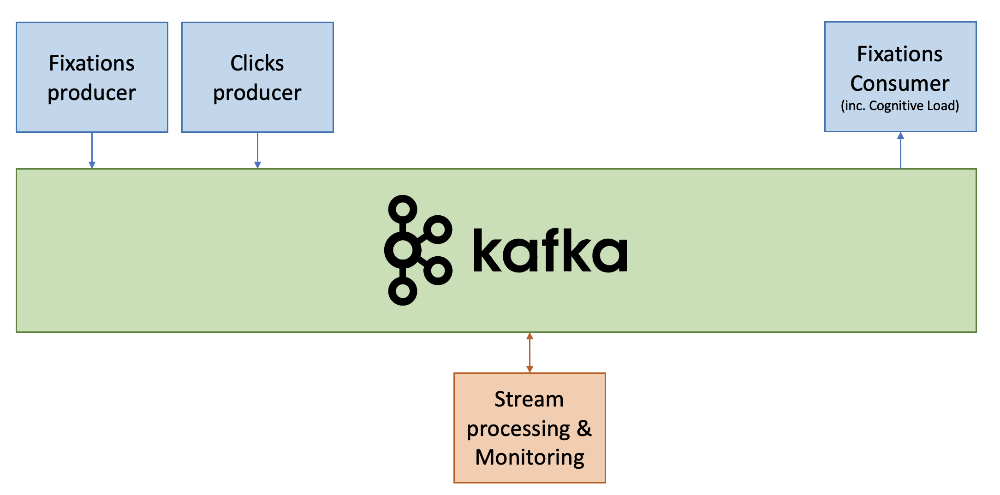
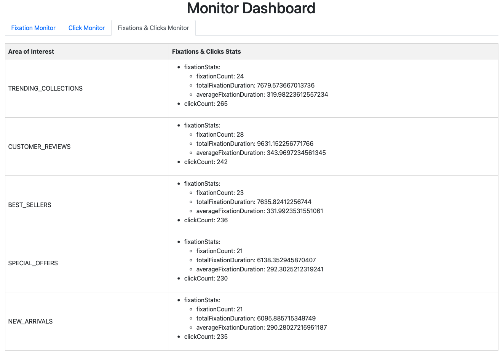

# lab13Part2-kafka-streams-eyeTracking2

This lab simulates the generation, processing, and consumption of fixation and click stream data.
The new topology covers both stateless and stateful processing.
The project consists of four main modules: a **fixation producer**, a **click stream producer**, an **event processing topology/monitor**, and a **fixation consumer**. 



The lab is based on https://github.com/scs-edpo/lab13Part1-kafka-streams-leaderboard and https://github.com/scs-edpo/lab12Part2-kafka-streams-eyeTracking1.

Only the new concepts are introduced.

## Running the Project

1. Open a terminal/command prompt and navigate to the project's root directory.
2. Run `docker-compose up` to start the Kafka broker, Zookeeper, and the schema registry.
3. Run the [EventProcessingApp](StreamProcessing/src/main/java/magicalpipelines/EventProcessingApp.java)  to process fixation and click stream data and apply various stateless and stateful event processors. _Use VM option: -DstateDir=/tmp/kafka-streams-ET (See [How to add VM options IntelliJ IDEA?](#VM) in the appendix.)_
4. Run the [FixationConsumer](FixationConsumer/src/main/java/FixationConsumer.java) to consume the processed fixation data.
5. run the [FixationProducer](FixationProducer/src/main/java/FixationProducer.java) to start generating fixation data.
6. run the [ClicksProducer](ClicksProducer/src/main/java/ClicksProducer.java) to start generating click stream data.
7. Browser http://localhost:7070 to track several event monitors

## Producing Fixations

The [FixationProducer](FixationProducer/src/main/java/FixationProducer.java) class is meant for generating random fixation events and sending them to a Kafka topic. The main steps in this class are:

1. Initialize Kafka producer with properties from the `producer.properties` file.
2. Generate random fixation events using the `generateRandomFixation()` method.
3. Send generated fixation events to the "fixations" Kafka topic.

## Producing Clicks

The [ClicksProducer](ClicksProducer/src/main/java/ClicksProducer.java) class is meant for generating random click stream events and sending them to a Kafka topic. The main steps in this class are:

1. Initialize Kafka producer with properties from the `producer.properties` file.
2. Generate random click events using the `generateRandomClick()` method.
3. Send generated click events to the "clicks" Kafka topic.


## Events processing

[EventProcessingApp](StreamProcessing/src/main/java/magicalpipelines/EventProcessingApp.java) uses the [EyeTrackingTopology](StreamProcessing/src/main/java/magicalpipelines/topology/EyeTrackingTopology.java) class which  is meant for processing raw fixation and click data through a series of stateless and stateful processors.

### Topology

1.**Stream Fixations**: Read events from the "fixations" Kafka topic using the custom FixationSerdes for deserialization. The resulting stream is called fixationStream.

2.**Stream Clicks**: Read click events from the "clicks" Kafka topic using the custom ClickSerdes for deserialization. The resulting stream is called clickStream.

**Stateless Event Processing (Content Filter, Event Filter, Event Translation, Event Routing)**


3.**Content Filtering**: Apply a content filter to keep only relevant attributes of each fixation (i.e., timestamp, xpos , ypos, fixationDuration, pupilSize). The new stream is called contentFilteredFixations.

4.**Event Filtering**: Filter the fixations by keeping only those with a duration equal to or greater than 60 milliseconds. The resulting stream is called eventFilteredFixations.

5.**Event Translation**: Translate the fixation events by finding the Area of Interest (AOI) based on x and y positions of fixations. The new stream is called eventTranslatedFixations.

6.**Event Routing**: Divide fixations into two branches based on a threshold for fixation duration (250 ms), simulating low and high cognitive load. The resulting branches are stored in an array called fixationBranches.

7.**Key Selection and Output Topic**: For each branch, create a new key based on the partitioning condition (i.e., threshold for fixation duration). Then, the fixation data is written to the "fixations-out" Kafka topic using the Avro Serde with Schema Registry. ``CustomPartitionerTranslatedFixation`` ensures that the fixation events are sent into different partitions based on their key (defined in Step 6).

**Stateful Event Processing (Grouping, Aggregation, Joining)**

8.**Group Fixations and Clicks by AOI**: Create two separate grouped streams for fixations and clicks, called groupedFixationsByAOI and groupedClicksByAOI, respectively.

9.**Aggregate Fixation Statistics**: Compute fixation count, total fixation duration and average fixation duration per AOI. The resulting KTable is called fixationStatsByAOI.

10.**Aggregate Click Count**: Compute the count of clicks per AOI. The resulting KTable is called clickCountByAOI.

11.**Join Fixation Statistics and Click Count**: Perform a join on the fixationStatsByAOI and clickCountByAOI KTables. The resulting KTable is called fixationAndClickCountsByAOI.


## Consuming Fixations

The [FixationConsumer](FixationConsumer/src/main/java/FixationConsumer.java)  class is meant for consuming the processed fixation events from a Kafka topic. The main steps in this class are:

1. Initialize Kafka consumer with properties from the `consumer.properties` file.
2. Subscribe to the "fixations-out" Kafka topic.
3. Continuously poll for new records, process them, and print the results, while discerning the fixation events associated with low and high cognitive load.


## Monitoring Fixation and Click Events

In the [EyeTrackingTopology](StreamProcessing/src/main/java/magicalpipelines/topology/EyeTrackingTopology.java) class, the KTables referring to the different aggregations/joining of fixation and click events (cf. Topology Steps 9—11) are materialized into 3 local stores named "fixationStats", "clickCount", and "FixationClickStats".

The [MonitorService](StreamProcessing/src/main/java/magicalpipelines/MonitorService.java) class is responsible for monitoring the fixation and click events using a Javalin web server. The methods `getFixationStats`, `getClickCount`, and `getFixationClickCount` are defined to query and retrieve data from the "fixationStats", "clickCount", and "FixationClickStats" local stores respectively.

The retrieved data is accessible through the Javalin web server with the following routes:

- `/fixationMonitor`: Returns the fixation statistics (fixation count, total fixation duration and average fixation duration per AOI) by calling the `getFixationStats` method.
  
```bash
curl http://localhost:7070/fixationMonitor
```

- `/clickMonitor`: Returns the click count per AOI by calling the `getClickCount` method.
```bash
curl http://localhost:7070/clickMonitor
```
- `/fixationClickMonitor`: Returns the joined fixation and click stats data by calling the `getFixationClickCount` method.
```bash
curl http://localhost:7070/fixationClickMonitor
```

The web-server offers also an interactive/self-refreshing GUI at http://localhost:7070. 




## Exercise

1. Explore the different classes of the project and examine the provided implementation. 
2. Try to extend the provided implementation such that the event monitor shows similar statistics on the pupil size measure (min, max, average per AOI).


<a name="VM"></a>
## Appendix: How to add VM options IntelliJ IDEA? 


